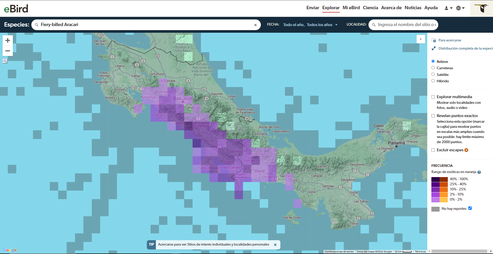

# *Pteroglossus frantzii*: Un análisis geoespacial de su hábitat y comportamiento

## Introducción al *Pteroglossus frantzii*

El ***Pteroglossus frantzii***, conocido como Arasarí piquinaranja, es una especie de tucán nativa de América Central, principalmente en Costa Rica y Panamá. Este sitio explora su distribución geográfica, características, y su importancia ecológica en los ecosistemas tropicales. Los arasarí son tucanes de tamaño mediano, delgados y de cola larga. El arasarí es distintivo por su brillante pico anaranjado y la banda roja en el vientre. Prefiere áreas boscosas, bordes y jardines. Se le conoce como *Arasarí piquinaranja, Fiery-billed, Tucancillo Piquianaranjado*, y también se le conoce coloquialmente como *Cusinga* en la zona sur de Costa Rica.

**Figura 1**
Imagen propia del *Pteroglossus frantzii*.

## Descripción de los datos

**Variables principales**:

- **Distribución geográfica**: El arasarí habita en las selvas del sur de Costa Rica y Panamá. Es un ave residente en la vertiente sur del océano Pacífico, siendo endémico regionalmente, particularmente de la región del Pacífico sur de Costa Rica y la región del Pacífico norte de Panamá.
- **Hábitat preferido**: Prefiere cualquier tipo de área boscosa, incluyendo bordes de bosque y jardines, donde encuentra su entorno ideal. Aunque su hábitat principal son las selvas, esta especie tiene la capacidad de ascender hasta los 1500 metros sobre el nivel del mar (msnm), adaptándose a una variedad de altitudes en su rango geográfico. Esta flexibilidad le permite ocupar una amplia gama de hábitats dentro de las regiones boscosas del sur de Costa Rica y el norte de Panamá.
- **Comportamiento alimenticio**: principalmente frugívoro, lo que significa que su dieta está compuesta mayormente por frutos. Sin embargo, su alimentación es bastante variada e incluye insectos, especialmente durante el período de reproducción, así como reptiles, huevos y pequeños polluelos de otras aves. Gracias a su largo pico, que le permite alcanzar frutos en ramas delgadas que no soportarían su peso, puede alimentarse de frutas ubicadas en lugares de difícil acceso. En ocasiones, también baja al suelo para consumir bayas. Esta adaptación a diferentes fuentes de alimento le permite mantener una dieta equilibrada en su entorno arbóreo.

**Origen de los datos**:

- Datos satelitales de cobertura forestal.
- Observaciones de campo y registros de biodiversidad.
- Estudios previos sobre el comportamiento alimenticio del Arasarí piquinaranja.

## Problemas a resolver / Preguntas a contestar

- **Distribución y conservación**: ¿Cuál es la distribución actual del **Pteroglossus frantzii** y cómo se relaciona con la pérdida de hábitat en su rango natural?
- **Cambio climático**: ¿Cómo afectará el cambio climático su hábitat en las próximas décadas?
- **Relaciones ecológicas**: ¿Qué impacto tiene su dieta en la dispersión de semillas y la regeneración forestal?

## Importancia ecológica y conservación

Los tucanes como el **Pteroglossus frantzii** desempeña un papel ecológico vital en los bosques tropicales. Su dieta frugívora lo convierte en un dispersador de semillas crucial, ya que consume una variedad de frutas y excreta las semillas en diferentes ubicaciones. Este proceso de dispersión contribuye a la regeneración de los bosques y al mantenimiento de la diversidad vegetal. Además, al consumir insectos y pequeños animales, el arasarí ayuda a controlar las poblaciones de estos organismos, contribuyendo al equilibrio del ecosistema.

La conservación del hábitat es esencial para preservar no solo a esta especie, sino también a la salud general del ecosistema. La destrucción de bosques húmedos y zonas montañosas, así como la reducción de la diversidad de plantas frutales, amenaza directamente la capacidad de este tucán para sobrevivir y realizar sus funciones ecológicas. Es fundamental implementar estrategias de conservación que protejan y restauren estos hábitats para asegurar la biodiversidad y el funcionamiento saludable de los ecosistemas tropicales. La protección del Pteroglossus frantzii y su entorno es una medida clave para mantener la integridad de los bosques tropicales y sus complejas redes de vida.
.

## Características principales del hábitat

1. **Bosques húmedos de tierras bajas:**
   Los bosques húmedos de tierras bajas proporcionan un entorno ideal para el _Pteroglossus frantzii_. Estos bosques, ricos en vegetación densa y humedad constante, ofrecen una amplia variedad de frutos y recursos alimenticios que son fundamentales para su dieta. La estructura compleja del dosel arbóreo de estos bosques permite al arasarí piquinaranja moverse fácilmente entre los árboles y acceder a su alimento preferido. Además, el clima húmedo favorece la abundancia de insectos y otros pequeños invertebrados que complementan su dieta.
2. **Zonas montañosas entre 500 y 1500 metros:**.
   El arasarí puede encontrarse a altitudes que varían entre 500 y 1500 metros sobre el nivel del mar. Estas áreas montañosas, con su variedad de microhábitats, ofrecen diferentes nichos ecológicos que el arasarí puede explorar. La altitud moderada contribuye a la diversidad de la vegetación, incluyendo plantas frutales que son cruciales para su alimentación. La variación en el terreno también proporciona diferentes oportunidades para el forrajeo y el anidamiento.
3. **Alta diversidad de plantas frutales:**
   La alta diversidad de plantas frutales en el hábitat es esencial para su dieta frugívora. La variedad de frutas disponibles asegura que el arasarí tenga acceso a una amplia gama de nutrientes. Las plantas frutales también atraen a otros pequeños animales, proporcionando al arasarí oportunidades adicionales para alimentarse de insectos y otros pequeños recursos. Esta diversidad frutal no solo es clave para su alimentación, sino que también influye en su comportamiento social y en la elección de su territorio.

**Figura 2**
Mapa de distribuición del *Pteroglossus frantzii*.

*Nota*: Esta imagen es extraída del visualizador web de la página.

**Figura 3**
Imagen del *Pteroglossus frantzii* en su hábitat.

## Enlaces de interés

- Enlace a un [página web](https://www.osabirds.org/fiery-billed-aracari/) sobre *Pteroglossus frantzii*.
- Enlace a la página de [eBird](https://www.birdlife.org) para más información sobre la distribución de esta especie.
- Enlace a [Osa Birds](https://www.osabirds.org/fiery-billed-aracari/) que da una descripción detallada del ave.

## Referencias bibliográficas

Bienzobas, G. (2021). *Tucán Aracari Picoanaranjado (Pteroglossus frantzii)*. The Explorers. Recuperado de: https://theexplorers.com/photo/tucan-aracari-picoanaranjado-pteroglossus-frantzii/es

eBird (s.f). *Fiery-billed Aracari*. Recuperado de https://ebird.org/species/fibara1?siteLanguage=es

Karen (2023). *Fiery-billed Aracari*. Osa Birds. Recuperado de: https://www.osabirds.org/fiery-billed-aracari/ 

### Figuras

eBird (s.f). *Fiery-billed Aracari*[Figura 2]. Recuperado de https://ebird.org/species/fibara1?siteLanguage=es

eBird (s.f). *Fiery-billed Aracari*[Figura 3]. Recuperado de https://ebird.org/species/fibara1?siteLanguage=es